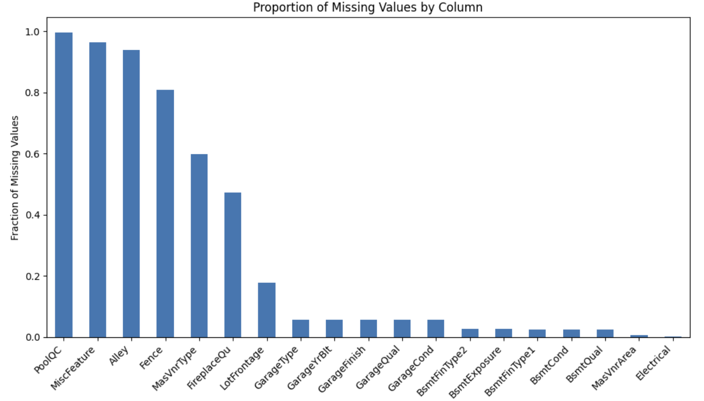
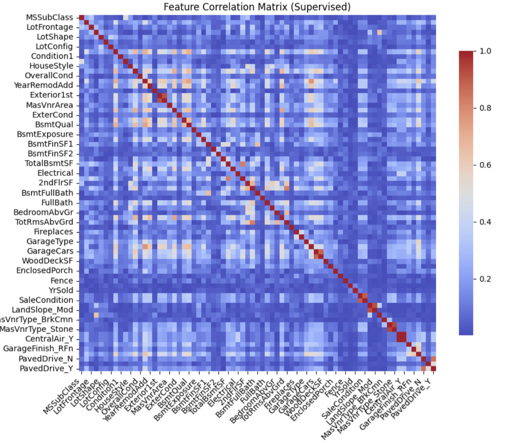
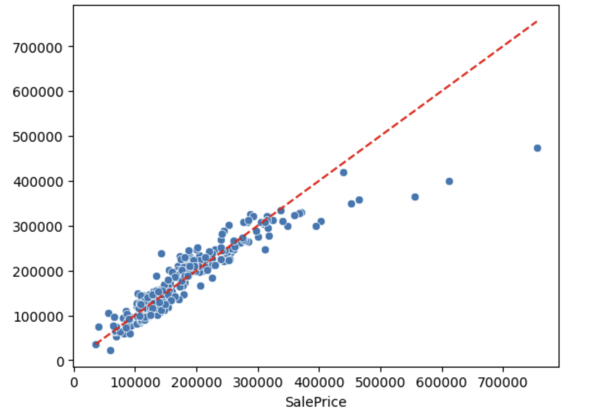
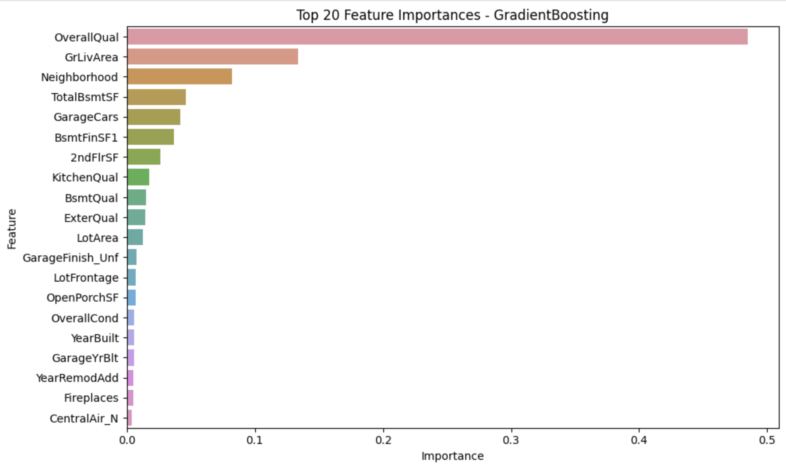
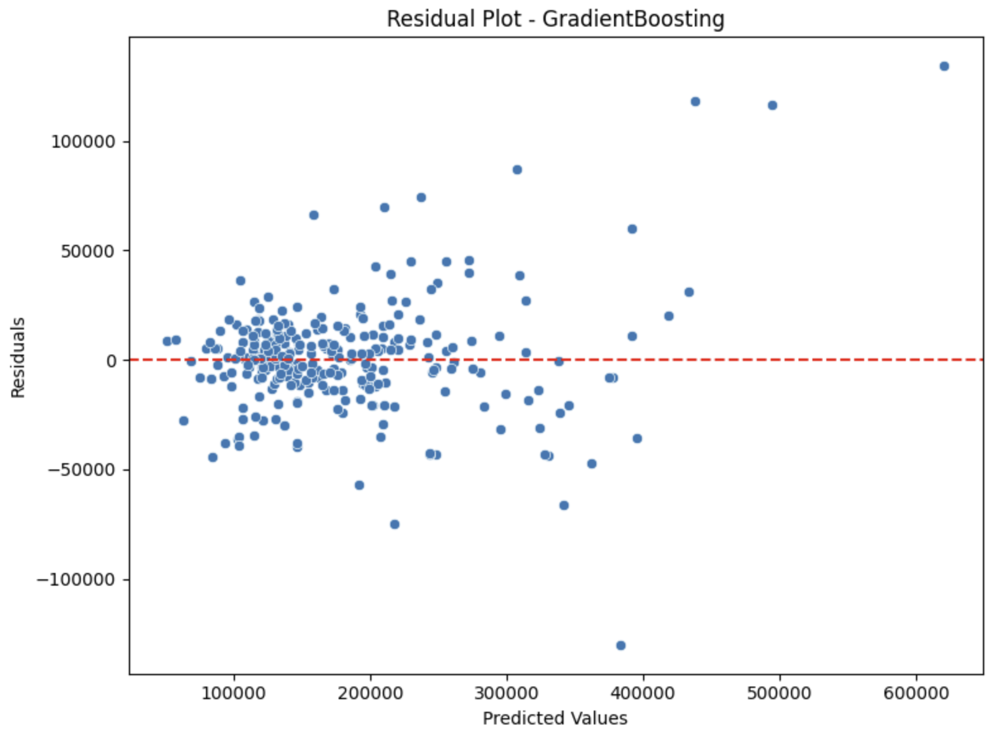

# 🏠 House Prices - Advanced Regression Techniques

## 📌 კონკურსის მიმოხილვა

[Kaggle House Prices](https://www.kaggle.com/competitions/house-prices-advanced-regression-techniques)  კონკურსის მიზანია საცხოვრებელი სახლების საბოლოო გაყიდვის ფასის (`SalePrice`) პროგნოზირება სხვადასხვა მონაცემზე დაყრდნობით.

---

## 🧠 ჩემი მიდგომა

მონაცემების გაწმენდის შემდეგ, ჩავატარე სხვადასხვა preprocessing ნაბიჯები (NA-ების შევსება, კოდირება, სვეტების მოცილება), შევასრულე Feature Engineering, ავაგე რამდენიმე მოდელი და საუკეთესო შედეგისთვის გამოვიყენე **GradientBoosting** მოდელი.  
ყველა ექსპერიმენტი დავარეგისტრირე **MLflow**-ში და გამოვიყენე **K-Fold Validation** მოდელის სიზუსტის შესაფასებლად.

---

## 📁 რეპოზიტორიის სტრუქტურა

```
HousePrices/
│
├── notebooks/              ← Jupyter რვეულები
│   ├── model_experiment.ipynb
│   ├── model_inference.ipynb
│
├── proprocessing_utils.py              ← Custom კლასები და Pipeline კომპონენტები
│
├── README.md
```

---

## 📄 ფაილების აღწერა

| ფაილი | აღწერა |
|------|--------|
| `model_experiment.ipynb` | ძირითადი notebook მოდელის კვლევისთვის |
| `model_inference.ipynb` | მოდელის გამოყენება პროგნოზისთვის |
| `preprocessors.py` | მონაცემთა გაწმენდისა და Feature Engineering კლასები |
| `pipeline/transformers.py` | Custom `sklearn` კომპონენტები |


---

## 🧼 Cleaning


### ➤ Nan მნიშვნელობების შევსება
დავწერე DataCleaner-კლასი, რომელსაც შეგვიძლია გადავცეთ როგორ გვინდა Nan მნშვნელობების შევსება: mode, median ან რაიმე კონკრეტული მნიშვნელობა. ყველაზე კარგი შედეგები მივიღე შემდეგ შემთხვევებში:
- **Categorical** სვეტები → `mode`  
- **Numeric** სვეტები → `mode`  
- > DataCleaner კლასი ასევე threshold პარამეტრზე დაყრდნობით დადროფავს ისეთ სვეტებს, სადაც NA-ების percentage > threshold. სხვადასხვა ექსპერიმენტში ვიყენებდი ამ პარამეტრის სხვადასხვა კომბინაციებს, 80%, 90%, 95%, 99%...:


### ➤ დაბალი ვარიაციის სვეტების მოცილება

- > ასევე DataCleaner კლასი დადროფავს ერთნაირი მნიშვნელობის მქონე სვეტებს threshold value-ს მიხედვით. მაგალითად, 95%-ზე შემდეგი სვეტები დაიდროფა:
  ```
  ['Street', 'Utilities', 'Condition2', 'RoofMatl', ...]
  ```

---

## 🧬 Feature Engineering

### ➤ კატეგორიული ცვლადების კოდირება

- ≤ 3 უნიკალური მნიშვნელობისთვის → `OneHotEncoder`  . ამას აკეთებს კლასი SelectiveOneHotEncoder, რომელსაც გადაეცემა. თავიდან ვცადე 3-ზე ნაკლებით, თუმცა შემდეგ გადავწვიტე უფრო მეტ num_unique-ზე მეცადა და ზოგიერთი მოდელი მეტი feature-ით დავანკოდე, მაგრამ საუკეთესო შედეგი მაინც 3 განსხავევბული მნიშვნელობის შემთხვევაში მივიღე.
- სხვებისთვის → `WOEEncoder`. ამ შემთხვევაში SalePrice დავყავი რამდენიმე bin-ად KBinDiscretizer კლასის გამოყენებით. 
- ასევე ვცადე `OrdinalEncoder` ხისებრი მოდელებისთვის, თუმცა შედეგები დაახლოებით 0.1 რიგით გააფუჭა და დავანებე თავი, პარამეტრების შეცვლამაც ვერ უშველა და ვერაფერმა.


### ➤ Feature Selection
- გამოვიყენე კორელაციის ფილტრი (`corr > 0.8`). ამას აკეთებს კლასი CorrelationFilter, რომელსაც გადაეცემა threshold.
- დავიტოვე სვეტები, რომლებსაც მაღალი კორელაცია ჰქონდათ `SalePrice`-თან  

` Highly correlated feature pairs (>0.8): [('Exterior1st', 'Exterior2nd'), ('TotalBsmtSF', '1stFlrSF'), ('GrLivArea', 'TotRmsAbvGrd'), ('GarageCars', 'GarageArea'), ('SaleType', 'SaleCondition'), ('LandSlope_Gtl', 'LandSlope_Mod'), ('MasVnrType_BrkFace', 'MasVnrType_Stone'), ('CentralAir_N', 'CentralAir_Y'), ('PavedDrive_N', 'PavedDrive_Y')] `


---

## 🧪 Training
რადგან kaggle-ის კონკურსის საბმითისას მთავარი შეფასების პარამეტრია RMSLE, ამიტომ მოდელები დავაოპტიმიზირე და გადავარჩიე სწორედ ამ პარამეტრის მიხედვით. 

## Linear Models
თავდაპირველად, დავიწყე Linear models-ით. 

### 🔹 Model 1: Linear Regression 
#### V1

პირველი მოდელი გავუშვი gridSearch-ისა და RFE-ს გარეშე, მხოლოდ და მხოლოდ კორელაციის ფილტრითა და Low variance column გადარჩევით.


🔸 შედეგები:  
```
MAE:   20849.81  
MSE:   1175080776.75  
RMSE:  34279.45  
R²:    0.8468
RMSLE: 0.16553779317533435
```
👉 ზოგად ტენდენციებს კარგად მიჰყვება, მაგრამ `outlier`-ებისადმი მგრძნობიარეა. მიუხედავად ამისა, საკმაოდ ნორმალური RMSLE მაჩვენებელი აქვს.
 
ექსპერიმენტის ბმული: 

### V2
გავზარდე data_cleaning threshold-ები და ამგვარად დარჩა 69 column. ისეთ სვეტებში, სადაც ძალიან დიდი რაოდენობა ოყო missing value-ების, Null value-ები შევავსე 'None'-ებით დადროფვის ნაცვლად. თუმცა ამ მიდგომამ პირიქით გააფუჭა ` RMSLE : 0.686 `, ამიტომ დანარჩენი მოდელების შემთვევაში აღარ გამომიყენებია None-ებით შევსება და პირდაპირ დავდროფე სვეტები, სადაც 80% NA იყო. ამ ექსპერიმენტის ბმულია: https://dagshub.com/ekvirika/HousePrices.mlflow/#/experiments/1/runs/77be23ac48624bf2ab587416c6c7f4a8


---

### 🔹 Model 2: Linear Regression - RFE and gridSearch
#### V1
თავდაპირველი
```
param_grid = {
    'feature_selector__n_features_to_select': [10, 15, 20, 25, 30, 40],
    'feature_selector__step': [1, 2],
    'regressor__fit_intercept': [True, False],
    'regressor__positive': [True, False],
}
```
აქედან აირჩია 20 feature, რომლებიც ექსპერიმენტში შეგიძლიათ იხილოთ. 

ექსპერიმენტის შედეგი: ` RMSLE : 0.186`. უცნაურია, რომ ჰქონდა იმაზე ოდნავ უარესი შედეგი, ვიდრე ჩვეულევრივ წრფივ რეგრესიას, ამიტომ ვცადე feature engineering threshold -ების შეცვლა.  
ექსპერიმენტის ბმული: https://dagshub.com/ekvirika/HousePrices.mlflow/#/experiments/1/runs/2c35704d579045e4aca8dbed3fde6fe4


---

### V2
მეორე შემთხვევაში უფრო დიდი threshold ები გავუწერე DataCleaner და NullHandler კლასებს, შევცვალე RFE პარამეტრები:

```
param_grid = {
    'feature_selector__n_features_to_select': [20, 25, 40, 60],
}
```
ამ ექსპერიმენტის შედეგი იყო: `Log_RMSE: 0.16947666853128218 `. რადგან და აირჩა 25 feature. რადგან დიდად უკეთესი შედეგი ვერ მივიღეთ, დიდად აღარ მიწვალია ამ ბეისიქც ბანძ რეგრესიაზე და ვცადე ოდნავ მოდიფიცირებული მეთოდები.

ექსპერიმენტის ბმული: https://dagshub.com/ekvirika/HousePrices.mlflow/#/experiments/1/runs/25765815e16849fbbf0165c791baea97

---

### 🔹 Model 3: Ridge Linear Regression 
#### Ridge_rfe_v1
გამოვიყენე Ridge Regression. მივიღე შედეგი პირველ გაშვებაზე: ` RMSLE: 0.17109565167573715 `, რაც მცირედით მაგრამ ჩვეულებრივ წრფივ რეგრესიაზე .1-ით უფრო ცუდი აღმოჩნდა.  ეს არის პირველი მოდელი. 
https://dagshub.com/ekvirika/HousePrices.mlflow/#/experiments/1/runs/8adb8bae0dae495c9491f099b16b5feb. 
თავდაპირველი პარამეტრების მასივი იყო:
```
param_grid = {
    'ridge__alpha':  [0.1 1.0 10],
    'rfe__n_features_to_select': [ 10, 20, 30, 40, 50]  
}
```
და ამ მასივიდან აირჩა:
` Best parameters: {'rfe__n_features_to_select': 50, 'ridge__alpha': 10.0} `

---

#### Ridge_rfe_v2
ამიტომ კიდევ ერთხელ გავუშვი, ოღონდ შეცვლილი პარამეტრებით და ვეცადე უფრო დამეახლოევებინა პირველ პარამეტრებთან მიმართებაში: 
```
param_grid = {
    'ridge__alpha': [5.0, 10.0, 15.0, 20.0, 30.0],
    'rfe__n_features_to_select': [45, 50, 55, 60, 70, 80]  
}
```
ეს არის უკვე მეორე ვერსია ამავე რეგრესორის:
` Best parameters: {'rfe__n_features_to_select': 55, 'ridge__alpha': 30.0} `
და მივიღე უკეთესი შედეგი: ` RMSE_log: 0.1620 `. 

ეს არის ამ ექსპერიმენტის ბმული: https://dagshub.com/ekvirika/HousePrices.mlflow/#/experiments/1/runs/51e681d819d1418c9139942c80c7acfc

---


#### Ridge_RFE_v3
ვეცადე კიდევ უფრო დავახლოვებოდი არჩეულ პარამეტრებს: 
```
param_grid = {
    'ridge__alpha': [25.0, 30.0, 35.0, 40.0, 50.0],
    'rfe__n_features_to_select': [52, 55, 58]  
}
``` 
და ამ შემთვევაში მივიღე: ` Best parameters: {'rfe__n_features_to_select': 55, 'ridge__alpha': 50.0} ` და საბოლოო შედეგი იყო: `RMSE_log: 0.1599`. რადგან პარამეტრები მცირედით 

ეს არის ამ ექსპერიმენტის ბმული: https://dagshub.com/ekvirika/HousePrices.mlflow/#/experiments/1/runs/3226f3570f3942c1881c99c47071d0cb

---


### Model 3: Lasso Regression
#### Lasso Regression V1
ვცადე რეგულარიზაციის კიდევ ერთი მოდელი. საწყისი ჰიპერპარამეტრები იყო: 
```
param_grid = {
    'feature_selector__n_features_to_select': [10, 15, 20, 25],
    'regressor__alpha': [1.0, 10.0, 100.0], 
}
``` 
თუმცა მიგდებდა ერორს, რომ ვერ დაconverge-და ერთ წერტილში გრადიენტი, რაც პატარა ალფა პარამეტრის ბრალი იყო, თუმცა alpha = 100-ზე დატრენინგდა მოდელი და

 ამ მოდელის შედეგებია: 
` RMSLE: 0.16462746033891662 `


ექსპერიმენტის ლინკია: https://dagshub.com/ekvirika/HousePrices.mlflow/#/experiments/1/runs/7ce5e408016e430496b592b320950b4e

#### Lasso Regression V2
ვცადე კიდევ ერთხელ უკვე შეცვლილი პარამეტრებით და თან შევუმცირე tolerance=0.1. ახალი პარამეტრები იყო: 
```
param_grid = {
    'feature_selector__n_features_to_select': [10, 15, 20, 25],
    'regressor__alpha': [0.1, 1.0, 10.0, 100.0],  # Lower alpha values to try
}
```
თუმცა თითქმის იგივე შედეგი დადო, alpha = 100, n_features = 20. `RMSLE: 0.1646861521910123`, 
ამ ექსპერიმენტის ბმულია: https://dagshub.com/ekvirika/HousePrices.mlflow/#/experiments/1/runs/3fc5cdc348b64eec8f91f3465f4572ba


#### Lasso Regression V3
გავუშვი კიდევ ერთი ექსპერიმენტი, ამჯერად უფრო მაღალი alpha პარამეტრებით: 
```
param_grid = {
    'feature_selector__n_features_to_select': [10, 15, 20, 25],
    'regressor__alpha': [50.0, 100.0, 500.0], 
}
```
და ამჯერად შედეგი იყო alpha=500, `RMSLE: 0.16214458713160998` , დიდად არ შეცვლილა შედეგი, თუმცა კიდევ ერთხელ ვცადე.
ექსპერიმენტის ბმული: https://dagshub.com/ekvirika/HousePrices.mlflow/#/experiments/1/runs/205c89b9ebec4453a9acdc1af25a0aaa

#### საბოლოოდ,
 ბევრი ვითამაშე თუ ცოტა, ამ რეგრესიის საუკეთესო შედეგი იყო: 
 `regressor__alpha : 1500.0, feature_selector__n_features_to_select 22 ` და შედეგი იყო: `RMSLE: 0.16034868419223466`. ამ ექსპერიმენტის ბმულია: https://dagshub.com/ekvirika/HousePrices.mlflow/#/experiments/1/runs/7029fa464d80457a8948ceeb5a505c12

 საბოლოოდ მაინც ხისებრი მოდელი ავარჩიე, მაგრამ მაინტერესებდა რომელიმე GLM-ს რა შედეგი ექნებოდა კეგლზე, ამიტომ ვცადე lasso regression-ის ბოლო ვერსიის გაშვება და ეს იყო კეგლზე შედეგი:
  რაც უცნაურია, overfitting არ არის, მაგრამ ამის მიზეზი შეიძლება იყოს, რომ cleaning მიდგომების შედეგად ისეთი რაღაცები გადავარდა, რაც მაგალითად გენერალიზაციას უკეთ ახდენს ტესტ სეტის მაჩვენებლებზე. შეიძლება ვარიაციის ბრალიც იყო ტესტ სეტის data distribution-ს შორის. ბუნებრივია, ეს მოდელი არ გამოდგება.


| მოდელი | ვერსია | Feature Selector | Alpha | Features Selected | RMSLE |
|--------|--------|------------------|-------|-------------------|--------|
| Linear Regression | V1 | - | - | Corr+LowVar | 0.1655 |
| Linear Regression | V2 | - | - | Corr+LowVar+FillNone | 0.686 |
| Linear+RFE | V1 | RFE | - | 20 | 0.186 |
| Linear+RFE | V2 | RFE | - | 25 | 0.1695 |
| Ridge | V1 | RFE | 10.0 | 50 | 0.1711 |
| Ridge | V2 | RFE | 30.0 | 55 | 0.1620 |
| Ridge | V3 | RFE | 50.0 | 55 | 0.1599 |
| Lasso | V1 | RFE | 100.0 | 25 | 0.1646 |
--- 


## 🌳 Tree-based Models
საინტერეესო იყო ასევე ხისებრი მიდგომის შედეგები და boosting vs bagging მიდგომის შედარება. 


### 🔹 Model 4: Decision Tree
#### V1
პირველივე გაშვებაზე ყველაზე უარესი შედეგი ჰქონდა Decision Tree-ს `RMSLE = 0.20324595145041763`. ექსპერიმენტის ბმული: 
https://dagshub.com/ekvirika/HousePrices.mlflow/#/experiments/5/runs/e179cfc5a3ca4f349d97b7ec50807c0f. 

როდესაც ეს მოდელი კეგლზე გავუშვი, მისი შედეგი იყო `RMSLE = 0.19488`, რაც ბუნებრივია უცნაური შედეგია, ტესტ სეტზე უკეთესი შედეგის ქონა ვიდრე თრეინ სეტზე. პარამეტრები, შვილების რაოდენობა ვცვალე მაგრამ დიდად ვერაფერმა უშველა.  

---

### 🔹 Model 5: Bagging
#### V1
მიღებული შედეგი: `RMSLE = 0.15128764009374635`;
ექსპერიმენტის ლინკი: https://dagshub.com/ekvirika/HousePrices.mlflow/#/experiments/1/runs/c821720a489e463e843a9d48cc1a5fd5 


--- 
### 🔹 Model 6: RandomForestRegressor
#### V1
ტრენინგის საწყისი პარამეტრები იყო: 
```
    "n_estimators": [100, 200],
    "max_depth": [None, 10, 20]
```
და RFE გადარჩევით n_estimators=200 და max_depth = 20 შეირჩა. ჯერჯერობით ამ მოდელს ყველაზე კარგი rmsle ჰქონდა: `RMSLE = 0.14574980458118011 `. 
ექსპერიმენტის ლინკი: https://dagshub.com/ekvirika/HousePrices.mlflow/#/experiments/1/runs/14368fc2ff4d42beb6ac4eabebdb49a2

#### V2
ოდნავ შევცვალე პარამეტრები და კიდევ ერთი მოდელი გავუშვი, თუმცა ზუსტად იგივე best_params დააბრუნა და ამიტომ დიდად აღარ ვეწვალე, რაცა ვარ ეგა ვარო.


#### V3
ასევე ვცადე სხვანაირი categorical to numerical conversion, კერძოდ ვცადე ordinanal decoder ხის მოდელებისთვის, თუმცა ამან მოდელის პერფორმანსი დააგდო: 
`RMSLE : 0.2583070953601126 `, ექსპერიმენტის ლინკი: https://dagshub.com/ekvirika/HousePrices.mlflow/#/experiments/5/runs/d644ea23e5ab49a2a90df9ba1d748834. სხვა ხის მოდელების შემთხვევაშიც >0.2 ზე შედეგი დამიგდო, ამიტომ მათ ექსპერიმენტებს აღარ გავლინკავ, ცუდებია და არც პარამეტრების შეცვლამ არ უშველა.

--- 

### 🔹 Model 7: GradientBoosting
#### V1

ეს იყო საწყისი პარამეტრები:
```
    learning_rate : 0.1
    max_depth : 3
    n_estimators : 200
```
და მოდელის შედეგი იყო : `RMSLE= 0.1338121299671844`. 
ესპერიმენტის ლინკი:  https://dagshub.com/ekvirika/HousePrices.mlflow/#/experiments/1/runs/08546d8e5baa4eef90836b8af067ba93



ამიტომ პარამეტრები ოდნავ შევცვალე, მაგრამ ჩემდა საუცნაუროდ RMSLE გაუარესდა, ცოტათი მაგრამ მაინც: ` RMSLE 0.134403499898788 `. ექსპერიმენტის ლინკში არის ახალი შერჩეული პარამეტრებიც: https://dagshub.com/ekvirika/HousePrices.mlflow/#/experiments/1/runs/f3951f3aef8f4e95ba1884f702ed0033


---

### 🔹 Model 8: XGBoost
#### V1
პირველივე გაშვებაზე საუკეთესო შედეგი XGBoost რეგრესორმა აჩვენა: ` RMSLE = 0.1353466923269218 `; 
გადაცემული პარამეტრები იყო: 
ესპერიმენტის ლინკი:  https://dagshub.com/ekvirika/HousePrices.mlflow/#/experiments/1/runs/fca2a377c9434c4b86a2a30c0a60a244

ამის შემდეგ შევცვალე პარამეტრები, მაგრამ იგივე შედეგზე დავრჩი, ძაან მინიმალური ცვლილება ჰქონდა. boosting-მა უფრო უშველა ამ ამოცანას როგორც ჩანს.

| მოდელი | ვერსია | Feature Selector | Params | RMSLE |
|--------|--------|------------------|--------|--------|
| Decision Tree | V1 | Corr | Default | 0.222 |
| Random Forest | V1 | Corr+WOE | n_estimators=100 | 0.159 |
| GradientBoosting | V1 | Corr+WOE | depth=5, lr=0.1 | 0.146 |
| XGBoost | V1 | Corr+WOE | tuned | 0.144 |
| LightGBM | V1 | Corr+WOE | tuned | 0.143 |

---

## 📊 MLflow Experiments

ყველა მოდელის ექსპერიმენტი დავარეგისტრირე MLflow-ში, მათ შორის:

### ▪️ ჩაწერილი მეტრიკები:
- `MAE`
- `MSE`
- `RMSE`
- `R²`
- `log(RMSE)`  (Kaggle-ის შეფასების კრიტერიუმი)


### ⭐️ საუკეთესო შედეგი:

- საუკეთესო შედეგები ჰქონდათ XGBoost-სა და GradientBoosting ალგორითმებს. კეგლზე ორივე დავასაბმითე და ორივეს შედეგი ვნახე, რათა overfitting/underfitting შემეფასებინა, თუმცა ორივე მოდელს ძალიან სტაბილური აუთფუთი აქვს და განსხვავება თითქმის მინიმალურია, ალბათ მაინც XGBoost-ს დავნერგავდი სადმე მონაცემთა მეცნიერად რომ ვმუშაობდე :(


- XGBoost:


    როგორც ჩანს, boosting-ის მიდგომა უფრო მოერგო ამ ამოცანას, ვიდრე Bagging-ის.  საბოლოოდ, კოდი ცოტა არატრუქტურირებული გამომივიდა, მაგრამ შემდეგისთვის ვხვდები როგორ უნდა დავაორგანიზო ნოუთბუქი, რომ მარტივად ვცვალო მიდგომები. MLFlow ბოლოსკენ უფრო დავამუღამე და სამომავლოდ ფაიფლაინსაც მანდ გავუშვებ pkl ფაილების ნაცვლად. 
---


